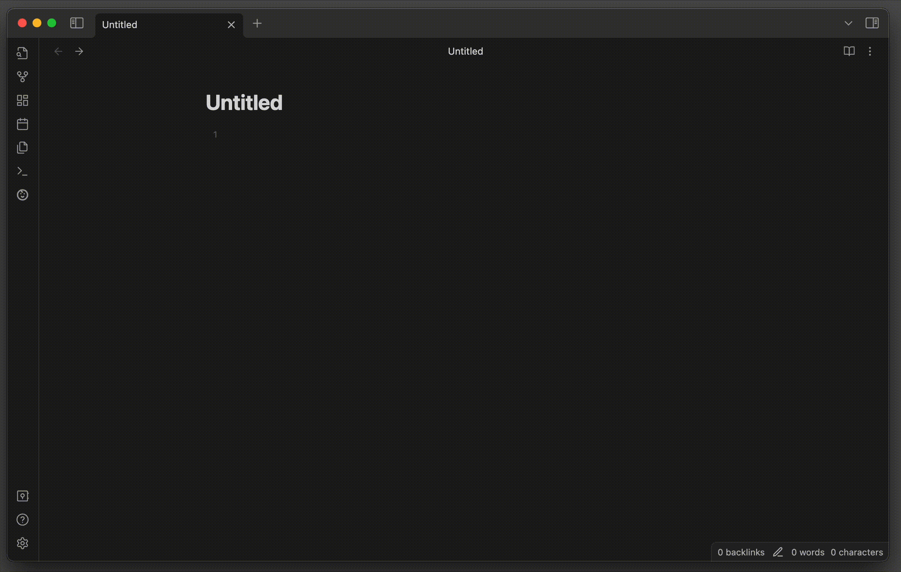

# Adjust Pasted Image Size

This Obsidian plugin enables automatic adjustment of display sizes for pasted images.

## Settings
### Default Width
Set the default width for pasted image.
### Default Height
Set the default height for pasted image (Use zero to disable this option).

## Note
If errors occured when you paste bunch of image at once, switch the editor to source mode to prevent errors.